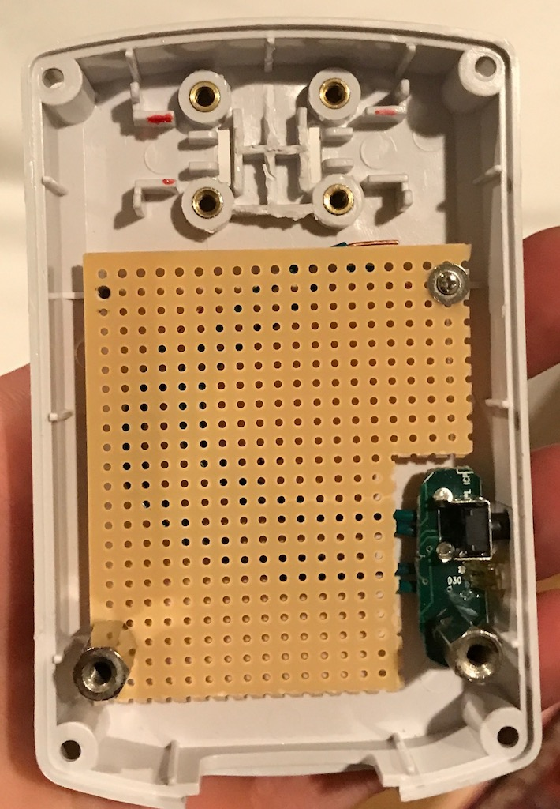
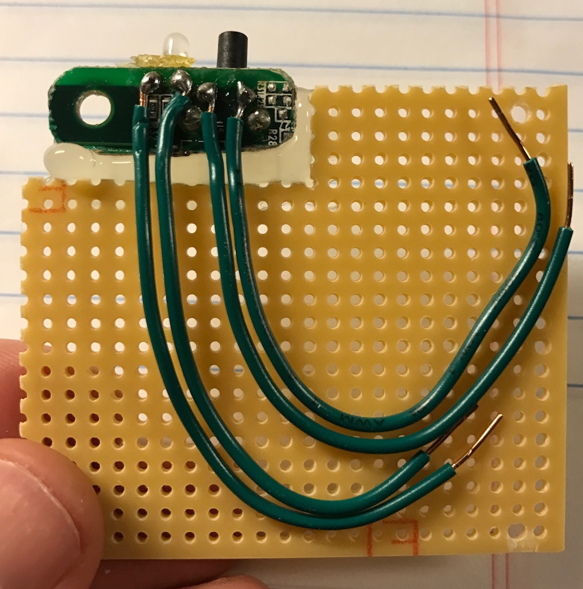
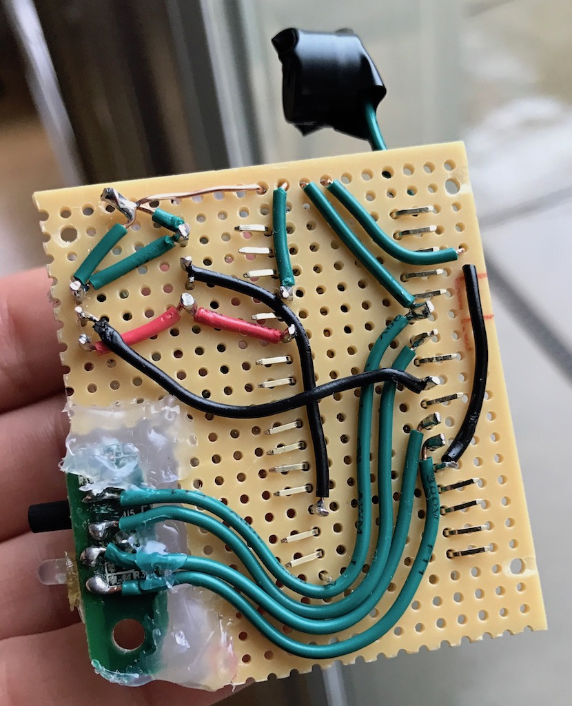
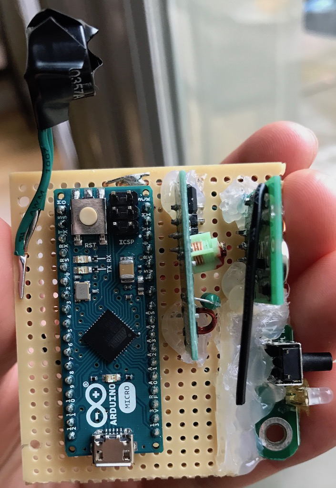

# Lightswitch for Arduino
Wirelessly relocated light socket

## Background
My apartment has a light switch by the entrance that toggles a poorly-located power outlet. I would like to transplant that outlet, but doing so would violate my rental agreement. The solution? Use an Arduino to wirelessly relocate the outlet!

## Hardware
1. Five pack of Etekcity 433 MHz RF power sockets with remote control. These can be obtained for around $25 US on Amazon. Other brands of similar compatible hardware exist, however this one is generally known to work.
2. 433 MHz transmitter and receiver modules. I bought six of each for $10 total.

### Additional hardware:
1. An Arduino. I used an Arduino Micro.
2. Two USB power adapters. One will power the Arduino itself, and the other will be used to monitor the on/off state of the poorly-located power outlet.
3. Project housing, wire, solder, USB cables, LED, piezo buzzer, and a push button.

## Approach
1. Teach the Arduino to learn the light switch's remote control codes and play them back on-demand.
2. Monitor the on/off state of a switched power socket, then automatically transmit the corresponding on/off radio signal.

## Design
This project was a quick hack. All of the pins used are defined in code, at the top of `main.cpp`. I used [PlatformIO IDE](http://platformio.org) for development, and a third-party library called [rc-switch](https://github.com/sui77/rc-switch) to simplify decoding and transmission of RF signals.

To monitor the state of the switched power outlet, I used a standard iPhone wall charger. This is effectively a small power supply capable of delivering 5 V DC / 1 A over USB. By stripping a USB cable's power leads and adding a current-limiting resistor, this DC power supply can be wired straight to a monitoring pin (plus ground) on the Arduino. By reading the value on the monitoring pin, you can identify whether the wall charger is actively receiving mains power. Note that there is a small ramp-up and drop-off delay when the power supply is energized/de-energized, so the design of the power supply will affect how quickly (and at what threshold) the Arduino is able to detect the mains power state.

To make the project somewhat user-friendly, I've added a red/green bi-color status LED, a piezo buzzer, and a push-button. The button can be tapped once to manually toggle the lights on and off for quick testing. The same button can be held down to enter a special programming mode where the device will learn new RF signals and store them in non-volatile (EEPROM) memory. This programming mode is used for initial set-up.

## The Result
It works! I have a light switch that can control multiple light sockets scattered throughout my living room.

## Photos
Here are some photos from development.

### Resources
* http://platformio.org
* https://github.com/sui77/rc-switch
* http://arduinobasics.blogspot.com.au/2014/07/433-mhz-rf-module-with-arduino-tutorial_30.html
